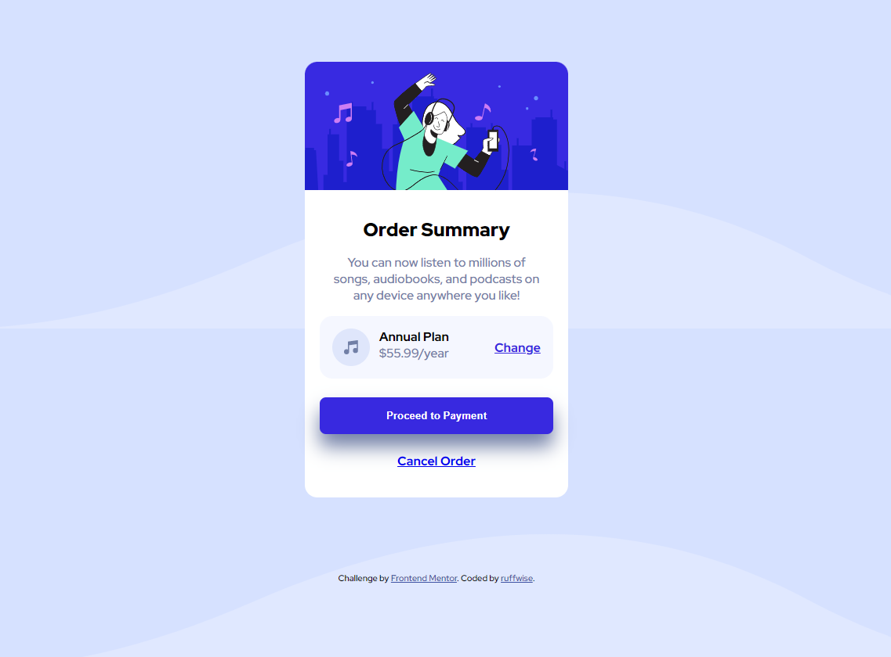

# Frontend Mentor - Order summary card solution

This is a solution to the [Order summary card challenge on Frontend Mentor](https://www.frontendmentor.io/challenges/order-summary-component-QlPmajDUj). Frontend Mentor challenges help you improve your coding skills by building realistic projects.

## Table of contents

- [Overview](#overview)
  - [The challenge](#the-challenge)
  - [Screenshot](#screenshot)
  - [Links](#links)
- [My process](#my-process)
  - [Built with](#built-with)
  - [What I learned](#what-i-learned)
  - [Continued development](#continued-development)
  - [Useful resources](#useful-resources)
- [Author](#author)
- [Acknowledgments](#acknowledgments)


## Overview

### The challenge

Users should be able to:

- See hover states for interactive elements

### Screenshot




### Links

- Solution URL: [https://github.com/ruffwise/order-summary-component.git](https://github.com/ruffwise/order-summary-component.git)
- Live Site URL: [https://ruffwise.github.io/order-summary-component/](https://ruffwise.github.io/order-summary-component/)

## My process

### Built with

- Semantic HTML5 markup
- CSS custom properties
- Flexbox
- - Mobile-first workflow


### What I learned

I learnt more about css buttons especially applying shadow to a button


```css
.button-shadow {
  box-shadow: 0 1rem 1.5rem hsl(224, 23%, 55%);
}
```

### Continued development

My continue development will be on CSS. I'd do more projects/challenges


### Useful resources

- [resource 1](https://developer.mozilla.org/en-US/docs/Web/HTML/Element/button) - This helped me with understanding css buttons.
- [resource 2](https://www.w3schools.com/cssref/css3_pr_box-shadow.php) - This help me with understanding more about button shadow.


## Author

- Frontend Mentor - [@ruffwise](https://www.frontendmentor.io/profile/ruffwise)


## Acknowledgments
